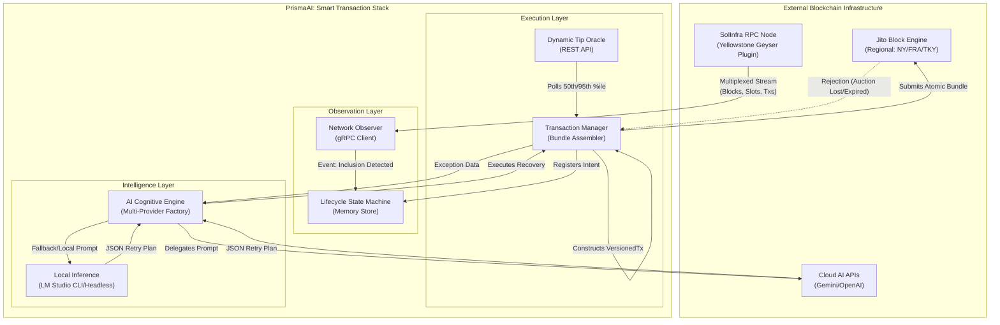

# PrismaAI: Advanced Transaction Infrastructure Specification

## 1. Executive Summary & Design Philosophy
The PrismaAI Transaction Stack is a high-frequency, production-grade orchestrator built for the Solana network. Standard DApps rely on slow HTTP RPC polling and non-deterministic transaction inclusion. This stack replaces legacy infrastructure with a sub-millisecond gRPC data pipeline (Triton Yellowstone via SolInfra), atomic bundle submission (Jito Block Engine), and an autonomous, multi-provider AI Cognitive Engine for intelligent error recovery. The primary design philosophy is **Deterministic Execution**: minimizing MEV leakage, eliminating transaction-fee drain from failed smart-contract executions, and responding to network jitter autonomously without human intervention.

---

## 2. System Architecture & Topology

### 2.1 Macro System Architecture (Mermaid)
*(Copy into [Mermaid Live Editor](https://mermaid.live/))*



---

## 3. Subsystem Deep Dives

### 3.1 Sub-millisecond Data Pipeline (Network Observer)
Standard Solana applications poll standard HTTP endpoints (`getSignatureStatuses`). This incurs a ~400-800ms penalty and is rate-limited. 
*   **The Yellowstone Advantage:** Our Network Observer establishes a persistent, multiplexed HTTP/2 socket using Triton's Yellowstone gRPC protocol. It streams data directly from a validator's Geyser plugin. 
*   **Implementation Mechanics:** We subscribe to `CommitmentLevel.PROCESSED`. The moment a leader executes the transaction and generates a shred, it is pushed to our observer. This allows the stack to detect landing intra-block, before full cluster consensus is reached.

### 3.2 Atomic Execution (Jito Transaction Manager)
A naive approach to high-frequency trading involves broadcasting transactions blindly. This results in paid network fees for failed smart contract executions (e.g., slipped trades).
*   **Bundle Atomicity:** We construct Solana `VersionedTransaction` instances that include user instructions alongside a `SystemProgram.transfer` to a verified Jito tip account. 
*   **The Auction:** The `Transaction Manager` wraps these transactions into a Jito `Bundle`. The bundle is submitted via the `searcherClient` to the Block Engine. If our tip wins the auction for the current slot, the entire bundle lands atomically. If it loses, or if the user instructions fail in simulation, the bundle is dropped entirely. *No tip is paid, and no network fee is drained.*

### 3.3 Dynamic Tip Oracle
Hardcoding tips (e.g., fixed at 0.0001 SOL) is dangerous. During quiet periods, it wastes capital. During NFT mints or high MEV volatility, it guarantees failure.
*   **Mechanism:** The `Dynamic Tip Oracle` queries the `https://bundles.jito.wtf/api/v1/bundles/tip_floor` low-latency endpoint before every submission.
*   **Logic:** It extracts the `landed_tips_50th_percentile` to ensure competitive, but cost-effective, auction participation. 

---

## 4. Lifecycle Tracking & State Machine

The `Lifecycle State Machine` is a rigorous in-memory store that audits the exact millisecond of state transitions. 

| Lifecycle State | Trigger Event | Technical Meaning |
| :--- | :--- | :--- |
| `SUBMITTED` | Local System Clock | The exact millisecond the payload leaves our node via `searcherClient.sendBundle`. |
| `PROCESSED` | gRPC Transaction Stream | A validator has included the transaction in a block. We calculate `Processed Delta = processed_at - submitted_at`. |
| `CONFIRMED` | gRPC or RPC Polling | 66%+ of the network stake has voted on the block. We calculate `Consensus Delta = confirmed_at - processed_at`. |
| `FINALIZED` | (Optional) Maximum lock | Over 31 slots have passed. Reorganization is cryptographically impossible. |

**Bounty Requirement Insight:** The delta between `processed_at` and `confirmed_at` acts as a **Network Health Oracle**. A high delta (e.g., > 3000ms) indicates cluster instability, high fork rates, or severe validator vote lag. Our stack monitors this to adjust submission timing.

---

## 5. AI Cognitive Framework & Autonomous Recovery

The AI Cognitive Engine is not a simple script; it is a **deterministic reasoning factory** capable of evaluating Solana infrastructure faults.

### 5.1 Multi-Provider Factory
To ensure 100% uptime, the engine utilizes a fallback architecture:
1.  **Primary (Cloud):** Google Gemini 1.5 Flash (via `@google/generative-ai`) for high-speed, structured JSON reasoning.
2.  **Secondary (Local/Headless):** LM Studio (`@lmstudio/sdk`). If the cloud provider rate-limits (429 Too Many Requests), the stack autonomously fails over to a local LLaMA/Mistral model running on the host machine. The system programmatically discovers local models via `client.system.listDownloadedModels` and loads them into VRAM with maximum GPU offload (`gpu: { ratio: "max" }`).
3.  **Tertiary (Hardcoded Autonomous Fallback):** If no local server is available, a built-in deterministic reasoner handles the exception to prevent crash loops.

### 5.2 The Prompt Engineering & Cognitive Loop
When an exception is caught, the AI is fed a highly structured prompt containing the exact error message and the surrounding context map (Current Tip, Congestion Level, Slot).

**Example AI Reasoning Output:**
```json
{
  "action": "retry",
  "reasoning": "Detected 'Expired blockhash'. This occurs when network congestion prevents the transaction from landing within 150 slots. Recommendation: Re-fetch a fresh blockhash using 'processed' commitment and increase the Jito tip by 25% to ensure inclusion in the next leader window.",
  "newTipMultiplier": 1.25,
  "refreshBlockhash": true
}
```

### 5.3 Failure Classification Strategy
The AI categorizes failures to apply the correct mitigation:
*   **Expired Blockhash:** (Critical fault) Indicates extreme latency between blockhash fetching and network ingestion. **Mitigation:** Refresh blockhash immediately. (Never use `finalized` blockhashes, as they are ~31 slots old upon arrival).
*   **Auction Lost (Bundle Dropped):** The tip was uncompetitive for the specific leader's blockspace. **Mitigation:** Retain current blockhash (if within 150 slots), drastically increase tip multiplier (`1.5x`), and resubmit.
*   **Leader Skipped:** The designated Jito leader went offline or missed their slot. **Mitigation:** Bundle silently drops. Re-assemble and target the next Jito leader in the schedule.

---

## 6. Infrastructure Specifications

To replicate this environment in a production setting:
*   **OS:** Ubuntu 22.04 LTS (Recommended for headless LM Studio Daemon).
*   **Compute:** NVIDIA GPU (RTX 3090 / 4090) if running local LLM inference. Otherwise, standard high-clock CPU instance.
*   **Networking:** Co-location with SolInfra's Frankfurt (FRA) nodes is highly recommended for sub 20ms latency to the gRPC endpoint.
*   **Environment Variables:** Strict separation of `.env` configuration ensures `AUTH_KEYPAIR` (Jito Block Engine auth) and `PAYER_KEYPAIR` (Treasury) are never hardcoded.
