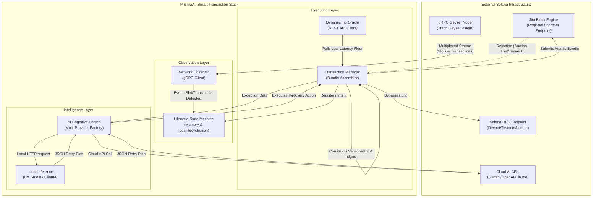

# PrismaAI: Smart Transaction Infrastructure Specification

## 1. Executive Summary & Design Philosophy
Standard Solana DApps rely on HTTP RPC polling (`getSignatureStatuses` or `getTransaction`) which introduces a significant latency penalty (~400-800ms) and suffers from severe rate-limiting under high network congestion. Furthermore, broadcasting transactions blindly leads to capital waste due to paid network fees for failed smart-contract executions (e.g., failed arbitrage, liquidations, or slipped trades).

The **PrismaAI Transaction Stack** is a production-grade transaction orchestrator designed to achieve **Deterministic Execution** on the Solana blockchain. It replaces legacy RPC polling with a sub-millisecond gRPC data pipeline (Triton Yellowstone via SolInfra or PublicNode), achieves atomic transaction execution via Jito Block Engine bundles, and utilizes an autonomous, multi-provider **AI Cognitive Engine** to handle operational exceptions, adjust tip multipliers, and manage failover pathways.

---

## 2. System Architecture & Topology

### 2.1 Macro System Architecture (Mermaid Diagram)
The diagram below illustrates the relationship between external RPC/gRPC resources and the internal components of the PrismaAI stack.



---

## 3. Subsystem Deep Dives

### 3.1 Sub-millisecond Data Pipeline (Network Observer)
Rather than polling standard HTTP RPC endpoints which are subject to severe latency jitter, the **[NetworkObserver](file:///home/rootkit/solstack/src/observer.ts#L22)** connects directly to the Geyser plugin of a validator via a secure Yellowstone gRPC stream.
*   **Multiplexed Subscriptions**: The observer subscribes to slot updates and transaction events at the `PROCESSED` commitment level. This means that as soon as the validator includes a transaction in a block (intra-slot), the block is streamed to our observer before full network consensus is reached.
*   **Robust Connection Resilience**: The connection implementation features backpressure-aware event emitters and an automatic reconnection loop with exponential backoff and a maximum retry cap of 10.
*   **Jito Leader Schedule Tracking**: Before submitting bundles, the observer queries the Jito Block Engine scheduler (`getNextScheduledLeader`) to check if a Jito validator is slated to win blockspace in the next few slots. If no Jito validator is scheduled, the system can hold or fallback to ensure optimal landing rates.

### 3.2 Atomic Execution (Jito Transaction Manager)
The **[TransactionStack](file:///home/rootkit/solstack/src/stack.ts#L13)** packages user instructions alongside a direct fee transfer (tip) to Jito's regional tip accounts.
*   **Bundle Atomicity**: Jito bundles are executed atomically. If the user instructions fail (e.g. slippage checks fail), the entire bundle is discarded by the Block Engine. **Crucially, this prevents tip payment and gas fee loss on failed executions.**
*   **Dynamic Jito Floor Pricing**: The **[getDynamicTip](file:///home/rootkit/solstack/src/utils/tip.ts#L16)** helper queries the Jito API tip explorer endpoint (`https://bundles.jito.wtf/api/v1/bundles/tip_floor`) to fetch the latest 50th, 75th, and 95th percentile tips. This avoids hardcoding tip values, securing transaction landing while avoiding capital waste during quiet market phases.

### 3.3 The AI Cognitive Engine & Operational Reasoning
The **[AIAgent](file:///home/rootkit/solstack/src/agent.ts#L390)** is the brain of the transaction stack. It is responsible for three critical operational decisions:
1.  **Tip Estimation**: Balancing landing probability against tip costs under varying network states.
2.  **Timing Decisions**: Holding or transmitting transactions based on leader schedules.
3.  **Failure Analysis & Autonomous Recovery**: Triage of exceptions to execute automated retry procedures.

To ensure 100% reliability, the engine utilizes a dynamic, unmocked failover chain:
1.  **Cloud Providers (Gemini / Claude / DeepSeek / OpenAI)**: Automatically builds client instances for any configured cloud AI backends depending on available environment API keys (e.g. `gemini-2.0-flash`, `claude-3-5-sonnet`, `deepseek-chat`, or `gpt-4o-mini`).
2.  **Local Backends (LM Studio / Ollama)**: Configures fallbacks to local endpoints (`http://localhost:1234` for LM Studio and `http://localhost:11434` for Ollama) to run local models (e.g. `glm-4.7-flash` or `llama3`).
3.  **Strict Failover Strategy**: If a provider fails, the stack transitions sequentially to the next candidate in the chain. No hardcoded or heuristic fallbacks are used; if all configured LLMs are unreachable or fail, the execution will abort cleanly.

---

## 4. UI Dashboard Subsystems

The PrismaAI stack supports two user interfaces, allowing operators to monitor the transaction pipeline in different environments:

### 4.1 Interactive CLI Dashboard (Mode 1)
The Interactive CLI is a terminal interface developed with `inquirer` and `chalk`. It implements a live event loop that:
1. **Polls the Yellowstone Geyser Stream**: Subscribes to the observer's slot and transaction emitters.
2. **Displays Live Slots & Jito Alerts**: Real-time status indicators alert the operator if a Jito validator leader is upcoming in the next few slots.
3. **Manual Cycle Trigger**: Allows users to dynamically input transfer parameters, choose the AI provider, and run complete execution loops while displaying live timing, tipping, and retry/broadcast pathways.

### 4.2 React Web Application Dashboard (Mode 2)
The React dashboard is a premium web client with a dark glassmorphic design system:
* **Connection Indicators**: Visual pills displaying current health and connection status for the Express API server and the gRPC Geyser client.
* **Cognitive Stepper**: A step-by-step pipeline visualizing the transaction progression:
  1. **AI Timing Decision**: Checks Jito validator schedule and schedules optimal delay slots.
  2. **AI Tipping Optimizer**: Computes tipping strategy based on congestion and Jito floors.
  3. **Jito Bundling**: Packs instructions and Jito block engine tips, builds the transaction, and executes the signed bundle.
  4. **Yellowstone Landing Stream**: Direct gRPC block signature verification to audit transaction landing within milliseconds.
* **Audit Ledger Cards**: Displays the reverse-chronological transaction log fetched from `/api/v1/transactions`, including slots, tips paid, landing latencies, and triage reports for failed bundles.

---

## 5. End-to-End Transaction Flow Data Map

The list below outlines the step-by-step progression of a transaction through the stack:

```
[React Web App / Interactive CLI]
               │
               ▼  1. Submit transaction details (destination, amount)
  [Express API / CLI Controller]
               │
               ▼  2. Check Jito leader schedules via Jito Searcher Client
  [AI Timing Decision]
               │  - Result: shouldSubmit (true/false) & waitTimeMs
               ▼
  [AI Tip Optimizer]
               │  - Result: tip in lamports (based on dynamic Jito floor & congestion)
               ▼
  [Bundle Assembly]
               │  - Assembles instruction + Jito tip transfer payload
               │  - Fetches fresh blockhash & signs transaction bundle
               ▼
  [Jito Block Engine submission]
               │
      ┌────────┴────────┐
      ▼ (Success)       ▼ (Failure / Timeout)
[Yellowstone gRPC]   [AI Triage & Exception Recovery]
      │                 │
      │                 ├─► Retry: increase tip, refresh blockhash, resubmit
      │                 ├─► Direct Broadcast: bypass Jito, broadcast to RPC
      │                 └─► Abort: end cycle
      ▼
[On-Chain Landing]
      │
      ▼  3. Stream signatures via gRPC Geyser client
[Lifecycle Tracker]
      │  - Write audit metrics to logs/lifecycle.json
      ▼
[React UI Updates]
```

---

## 6. Lifecycle Tracking & State Machine
The **[LifecycleTracker](file:///home/rootkit/solstack/src/tracker.ts#L54)** acts as the stack's audit ledger, tracking timestamps and deltas:
*   `Processed Delta = processed_at - submitted_at`: Tracks the time from transmission to block inclusion.
*   `Consensus Delta = confirmed_at - processed_at`: Measures cluster consensus stability. High deltas suggest network congestion or high fork rates.
*   All entries are logged to [logs/lifecycle.json](file:///home/rootkit/solstack/logs/lifecycle.json) with dynamically appended Solscan links corresponding to the target network.

---

## 7. Failure Triage & Recovery Strategy
When an error is caught during execution, the AI categorizes the exception:

| Error Classification | Root Cause | AI Action | Recovery Mechanism |
| :--- | :--- | :--- | :--- |
| **ExpiredBlockhash** | Slot latency exceeded 150 slots | `RETRY` | Refreshes the blockhash using `processed` commitment, increases the Jito tip by 25% to gain auction priority, and resubmits. |
| **FeeTooLow** | Under-bid Jito tips | `RETRY` | Recalculates the tip floor, applies a `1.5x` tip multiplier, and rebundles. |
| **Jito Timeout / Connection Fail** | Jito Block Engine is offline or gRPC socket blocks | `DIRECT_BROADCAST` | Bypasses Jito, signs transaction directly, and broadcasts to standard RPC validators to ensure on-chain landing. |
| **ComputeExceeded** | Smart-contract execution exceeded transaction compute budget | `ABORT` | Aborts transaction cycle to prevent fee drain. |

---

## 8. Custom Node Support & gRPC Independence
The stack is fully decoupled from any single node service provider.
* **Triton/Custom Node Support**: Standard `@triton-one/yellowstone-grpc` is used for client creation. If the host endpoint uses a different authentication schema (such as authorization headers inside URL parameters or custom TLS certificates), the gRPC client resolves it dynamically.
* **Flexible Authentication**: If an API key is not required (e.g. standard local gRPC or open community gateways), passing empty credentials initializes standard connection pipelines without throwing exception errors.
